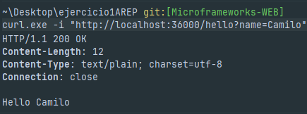
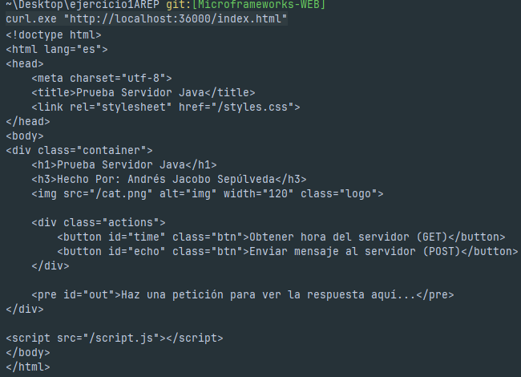
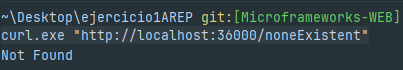

# Web Framework Development for REST Services and Static File Management

This repository contains a minimal Java web framework built on top of raw Java Socket I/O.
It began as a socket-based HTTP server for learning purposes and was extended into a small framework that supports:

- registering REST handlers with ```get(...)``` using lambdas.

- extracting query parameters from requests

- serving static files from a configurable folder.

## Getting Started

Before you run this project, make sure you have the following installed:

### Prerequisites

- **Java JDK 8+**  
  Verify installation:
  ```bash
  java -version
  ```
  Example output:
    ```  
    openjdk version "17.0.9" 2023-10-17
    ```
- **Maven 3.6+ (to build and run the project)**
    Verify installation:
    ```
    mvn -v
    ```
    Example output:
    ```
    Apache Maven 3.9.6
    ```
- An IDE (optional): IntelliJ IDEA is recommended for easier development and debugging.
    
### Installing

A step-by-step series of examples that tell you how to get a development environment running.

**Step 1 - Clone or download the repository**
```
git clone https://github.com/Jaco0bo/ejercicio1AREP.git
cd java-socket-http-server
```

**Step 2 - Build the project with Maven**
```
mvn clean package
```

This will download dependencies and generate compiled classes under the target directory.

**Step 3 - Run the server**

You can run the server from the terminal:
```
mvn exec:java -Dexec.mainClass="org.escuelaing.edu.co.HttpServer"
```

Expected output:
```bash
Listening on http://localhost:36000/
```

## Running the tests

This project includes a set of automated tests to ensure that the socket server and client work as expected. The tests cover both end-to-end functionality and coding style.

### End-to-end tests

End-to-end tests simulate a real interaction between the client and the server. These tests ensure that when a client sends a message to the server, the server correctly echoes the message back.

Example:

From the project, run:
```bash
HttpServerTest.java class
```
If successful, you should see output confirming that the test passed and confirmating the correct operation of the class.

## Deployment

Because this is an academic exercise, you can´t deploy the Http server to a live environment to allow multiple clients to connect :(.

## Built With

This project was built with the following tools and libraries:

- **Java** — Core programming language used to implement the socket HTTP server.  
- **Maven** — Build tool and dependency management (`pom.xml` included).  
- **JUnit 5** — Unit testing framework used for automated tests.  
- **IntelliJ IDEA** — Recommended IDE for development and debugging (optional).

> Note: This project does **not** use Spark, Spring Boot, or other web frameworks — it is intentionally minimal and socket-based for learning purposes.

---

## Demo

```bash
# GET with query parameter
curl -i 'http://localhost:36000/App/hello?name=Pedro'

# GET returning a numeric (or plain) value
curl -i 'http://localhost:36000/App/pi'

# POST echo example (form-urlencoded)
curl -i -X POST -H "Content-Type: application/x-www-form-urlencoded" -d 'a=1&b=2' 'http://localhost:36000/api/echo'

# Static file (index)
curl -i 'http://localhost:36000/index.html'

# 404 / Not found
curl -i 'http://localhost:36000/nonexistent'

# Directory traversal attempt (should be blocked)
curl -i 'http://localhost:36000/../pom.xml'
```








if you are using Windows put curl.exe to avoid the ```Invoque-WebRequest```

## Architecture & main components

### This framework is intentionally small and composed of a few focused classes:

- ```HttpServer```

  - Entry point and request loop (synchronous model).

  - Instantiates a single ```Router```, registers routes and static folder, accepts sockets and delegates handling.

- ```RequestParser```

  - Parses raw HTTP request lines, headers and body into a ```Request``` object.

  - Respects ```Content-Length``` and decodes query string into a ```Map<String,String>```.

- ```Request```

  - POJO representing the incoming request: ```method```, ```path```, ```fullPath```, ```queryParams```, ```headers```, ```body (byte[])```.

  - Helpers: ```getQueryParam(name, default)```, ```bodyAsString()```, etc.

- ```Response```

  - Wrapper over the socket ```OutputStream```. Helpers include: ```status(int)```, ```header(String,String)```, ```send(String|byte[])```,   ```sendError(int,String)```, ```isSent()```

  - Responsible for formatting the HTTP response (status line, headers, Content-Length, body) and flushing.

- ```Router```

  - Stores routes keyed by ```METHOD:normalizedPath``` (e.g. ```GET:/App/hello```).

  - Registration helpers: ```get(path, handler)```, ```post(path, handler)```, ```put(...)```, ```delete(...)```.

  - ```staticFiles(directory)``` sets the static root.

  - ```handle(Request, Response)``` dispatches to handler, falls back to static files if configured, otherwise returns 404.

## How to register routes & static folder

Register routes once at server startup (before the accept loop):

```java
Router router = new Router();
router.staticFiles("src/main/resources/public");

// Register GET handlers
router.get("/App/hello", (req, res) -> "Hello " + req.getQueryParam("name", "world"));
router.get("/App/pi", (req, res) -> String.valueOf(Math.PI));

// Register POST handler
router.post("/api/echo", (req, res) -> req.bodyAsString());
```

**Handler contract**

- Handlers are ```BiFunction<Request, Response, Object>```. They receive ```req``` and ```res``` and can:

  - Return a ```String``` or ```byte[]``` (if the handler returns a value and ```res.isSent()``` is false, the server will convert and send it)

  - Write directly to the response using ```res.header(...)``` and ```res.send(...)``` for full control (in this case the router will not send an extra body).

**Static files**

- Call ```router.staticFiles("path/to/webroot")``` to set the directory used for static file serving.

- If a route is not found, the router will attempt to serve a file from that folder (with directory-traversal protection).

## How requests are handled (flow)

1. ```HttpServer``` accepts a socket connection.

2. ```RequestParser.parse(socket, timeout)``` parses request-line, headers and body → returns ```Request```.

3. ```HttpServer``` creates ```Response``` wrapping the socket ```OutputStream```.

4. ```HttpServer``` calls ```router.handle(request, response)```.

5. ```Router:```

- looks up ```METHOD:normalizedPath```,

- if a handler exists, invokes it

- else tries to serve a static file (if configured)

- else sends 404.

6. If handler returned an ```Object``` and ```res.isSent()``` is false, ```HttpServer``` or the router will convert the result (```String``` → ```text/plain```, ```byte[]``` → raw body) and send it.

## Contributing

If you would like to contribute, please:

1. Fork the repository.
2. Create a feature branch: `git checkout -b feature/my-change`
3. Run the tests locally: `mvn test`
4. Commit your changes: `git commit -m "Add my feature"`
5. Push to the branch: `git push origin feature/my-change`
6. Open a Pull Request describing the change and why it is useful.

## Authors and Acknowledgments

- **Jacobo Sepulveda** — Initial work (author).  
  - GitHub: `https://github.com/Jaco0bo`

Acknowledgments:
- Networking and HTTP internals tutorials and reference materials.
- Course and teacher guidance used to shape this exercise.
