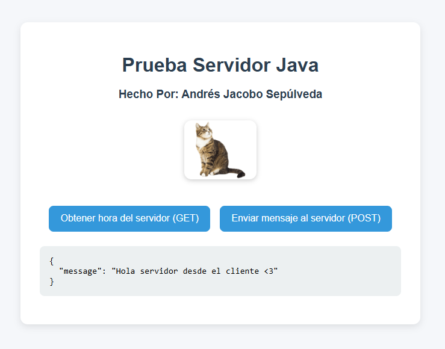

# Workshop on Designing and Structuring Distributed Internet Applications (WORK 1)

## Andrés Jacobo Sepúlveda Sánchez

This project is a minimal HTTP server implemented with raw **Java sockets**. It is meant as an academic exercise to understand how HTTP works under the hood, without using frameworks like Spring Boot or Spark.


## Getting Started

Before you run this project, make sure you have the following installed:
### Prerequisites

- **Java JDK 8+**  
  Verify installation:
  ```bash
  java -version
  ```
  Example output:
    ```  
    openjdk version "17.0.9" 2023-10-17
    ```
- **Maven 3.6+ (to build and run the project)**
    Verify installation:
    ```
    mvn -v
    ```
    Example output:
    ```
    Apache Maven 3.9.6
    ```
- An IDE (optional): IntelliJ IDEA is recommended for easier development and debugging.
    
### Installing

A step-by-step series of examples that tell you how to get a development environment running.

**Step 1 - Clone or download the repository**
```
git clone https://github.com/Jaco0bo/ejercicio1AREP.git
cd java-socket-http-server
```

**Step 2 - Build the project with Maven**
```
mvn clean package
```

This will download dependencies and generate compiled classes under the target directory.

**Step 3 - Run the server**

You can run the server from the terminal:
```
mvn exec:java -Dexec.mainClass="org.escuelaing.edu.co.HttpServer"
```

Expected output:
```bash
Listening on http://localhost:36000/
```

## Running the tests

This project includes a set of automated tests to ensure that the socket server and client work as expected. The tests cover both end-to-end functionality and coding style.

### End-to-end tests

End-to-end tests simulate a real interaction between the client and the server. These tests ensure that when a client sends a message to the server, the server correctly echoes the message back.

Example:

From the project, run:
```bash
HttpServerTest.java class
```
If successful, you should see output confirming that the test passed and confirmating the correct operation of the class.

## Deployment

Because this is an academic exercise, you can´t deploy the Http server to a live environment to allow multiple clients to connect :(.

## Built With

This project was built with the following tools and libraries:

- **Java** — Core programming language used to implement the socket HTTP server.  
- **Maven** — Build tool and dependency management (`pom.xml` included).  
- **JUnit 5** — Unit testing framework used for automated tests.  
- **IntelliJ IDEA** — Recommended IDE for development and debugging (optional).

> Note: This project does **not** use Spark, Spring Boot, or other web frameworks — it is intentionally minimal and socket-based for learning purposes.

---

## Contributing

If you would like to contribute, please:

1. Fork the repository.
2. Create a feature branch: `git checkout -b feature/my-change`
3. Run the tests locally: `mvn test`
4. Commit your changes: `git commit -m "Add my feature"`
5. Push to the branch: `git push origin feature/my-change`
6. Open a Pull Request describing the change and why it is useful.

## Authors

- **Jacobo Sepulveda** — Initial work (author).  
  - GitHub: `https://github.com/Jaco0bo` *

## Acknowledgments

- Hat tip to classic low-level networking examples and tutorials that explain sockets and HTTP basics.  
- Inspiration: articles and books on TCP/IP and HTTP internals.  
- Thank you to the teacher for the questions resolved in class and a lot of internet web pages and IA help.

## Demo

If you followed the steps above and started the server then open your browser and go to:
```
http://localhost:36000/
```
You should see a page and responses similar to the screenshots below.





# Project Statement: Web Framework Development for REST Services and Static File Management (WORK 2)

## Objective: 

This project aims to enhance an existing web server, which currently supports HTML files, JavaScript, CSS, and images, by converting it into a fully functional web framework. This framework will enable the development of web applications with backend REST services. The new framework will provide developers with tools to define REST services using lambda functions, manage query values within requests, and specify the location of static files.

## Project Scope and Features:

**1. GET Static Method for REST Services:**

  - Implement a get() method that allows developers to define REST services using lambda functions.
    
  - Example Usage:
    ```get("/hello", (req, res) -> "hello world!");```
    
  - This feature will enable developers to define simple and clear routes within their applications, mapping URLs to specific lambda expressions that handle the requests and responses.
    
**2. Query Value Extraction Mechanism:**

- Develop a mechanism to extract query parameters from incoming requests and make them accessible within the REST services.
  
- Example Usage:
  ```get("/hello", (req, res) -> "hello " + req.getValues("name"));```
  
- This functionality will facilitate the creation of dynamic and parameterized REST services, allowing developers to easily access and utilize query parameters within their service implementations.
  
**3. Static File Location Specification:**

- Introduces to ```staticfiles()``` method that allows developers to define the folder where static files are located.
  
- Example Usage:
  ```staticfiles("webroot/public");```
  
- The framework will then look for static files in the specified directory, such as target/classes/webroot/public, making it easier for developers to organize and manage their application's static resources.
